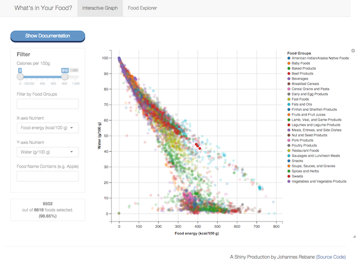

## Overview of "What's in Your Food" | App is a tool for nutrition insight discovery and visualization 

<div class="columns-2">
<p>Ever wonder how much dietary fiber is in your burrito? </p>
<p>Ever wonder what you should eat to maximize your protein intake while minimizing your fat intake?</P>
<p><b>You can use this app to answer those questions and more.</b></p>

<figure align= "center">
<a href = "http:https://jrebane.shinyapps.io/DevelopingDataProducts_Project/"></a><br>
<figcaption>Screenshot of "What's in Your Food?" (Click screenshot to visit)</figcaption>
</figure>
</div>

## How does it add value? | "What's in Your Food?" provides insights through interactive visualization

<div class="columns-2">
<iframe src="venn.html"></iframe>

#### Detailed nutrition facts
- Data are from the <a href = "http://ndb.nal.usda.gov/ndb/">USDA's Nutrition Database</a> which, while not visually friendly, is the go-to source for accurate and detailed nutrition data

#### Easy to use
- Users can navigate foods with an interactive graph or table
- Filters and search help users find subsets of food easily and creatively

#### Visual
- Users can plot foods by nutrient values and food groups and quickly visualize their findings
- Dynamic tooltips make weaving through the data much easier

## What data are in the app? | Users can analyze 8617 foods based on 46 nutritional content indicators

```{r, message = FALSE, echo = FALSE}
source("app/global.r")
require(ggvis)
require(dplyr)
require(RSQLite)
require(knitr)
require(treemap)

db <- src_sqlite("app/Food.sqlite")
food <- tbl(db, "Food")
df <- food %>%
  filter(
    Energy >= 0,
    Energy <= 1000)
df <- as.data.frame(df)
```

```{r, fig.height=3, fig.width = 7.5, fig.align='center'}
food_count <- as.data.frame(table(df$FoodGroup))
treemap(food_count, "Var1", "Freq", fontface.labels = "plain", 
        title = "Composition of Nutrition Data Frame for App")
```

## What does it look like? | Check out a sample of "What's in your Food?" below

```{r, echo =FALSE, message=FALSE, warning=FALSE}
xvar_name <- names(axis_vars)[axis_vars == "Energy"]
yvar_name <- names(axis_vars)[axis_vars == "Protein"]

xvar <- prop("x", as.symbol("Energy"))
yvar <- prop("y", as.symbol("Protein"))

p1 <- df %>%
    # Creating the graph! Weeeee!
    ggvis(~Energy, ~Protein) %>%
    layer_points(fill = ~factor(FoodGroup), size := 50, size.hover := 200,
                 fillOpacity := 0.2, fillOpacity.hover := 0.7,
                 key := ~FoodName) %>%
    add_tooltip(food_tooltip, "hover") %>%
    add_axis("x", title = xvar_name) %>%
    add_axis("y", title = yvar_name) %>%
    add_legend(scales = "fill", title = "Food Groups") %>%
    set_options(width = 500, height = 375)
p1
```
<figcaption>Note: No tooltips shown here due to ggVis limitations with knitr</figcaption>